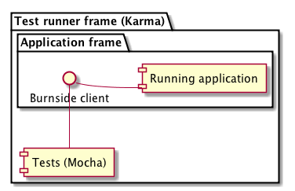

## Burnside

> Test your entire app, end to end, in pure JavaScript

Burnside is an easy to use, modular, and extendable End to End (E2E) testing tool. Burnside leverages the flexibility of JavaScript and the power of modern Browser APIs to inject logic and scripting into your website, without the slowdown of networking for every individual command.

> Looking for something more hands on? Check out Burnside's interactive, [Test-Driven Tutorial!](#tutorial)

<a name="installation"></a>
### Installation

```
$ npm install --save-dev burnside-cli
```

<a name="usage"></a>
### Usage
```JSON
{
  "scripts": {
    "burnside": "burnside ./path/to/tests.js --startup='./exampleServer.sh' --condition='start' --wait=5000 --browsers=chrome,firefox"
  }
}  
```

<a name="cli-usage"></a>
### Command Line Options
Burnside's CLI supports the following flags:

.alias('b', 'browsers')
  .alias('t', 'timeout')
  .alias('s', 'startup')
  .alias('c', 'condition')
  .alias('k', 'karmaConfig')
  .alias('v', 'verbose')

| Options | Example | Purpose |
| ------ | ------- | ------- |
| `<default>` | `./path/to/tests.js` | Your Test File. Webpack is built in so use `require` for more files. |
| `--verbose` `-v` | `--verbose` | Turns up logging and adds request tracing |
| `--startup` `-s` | `--startup='./exampleServer.sh'` | An _optional_ startup command for your application. |
| `--condition` `-c` | `--condition='startup'` | An _optional_ startup message for Burnside to wait on |
| `--wait` `-w` | `--wait=500` | The amount of time Burnside will wait for the `startup` `condition` to be reached, if specified. Defaults to 5000 |
| `--browsers` `-b` | `--browsers=chrome,firefox` | The browsers Burnside should attempt to use when testing. You're responsible for making sure they are installed and configured. Available: `chrome` and `firefox` |
| `--karmaConfig` `-k` | `--karmaConfig=./burnside.karma.conf.js` | A relative path to an optional Karma configuration. You can use this to override settings, inject Karma plugins, and configure them while also allowing Burnside to add in its own [required Karma configuration](https://github.com/Nike-Inc/burnside/tree/master/packages/burnside-cli/karma.conf.js) to be layered on afterward. For more information visit on how to work with Karma, visit its [Documentation](https://karma-runner.github.io/1.0/config/configuration-file.html) |

Burnside is a modular ecosystem based on a core that runs inside of a Browser. The CLI bundles Karma and Webpack to load your tests within Chrome, but you can use Burnside's core with any Test Runner you'd like to set up.
> If you'd like to configure your own test runner, we've included a [Sample project](https://github.com/Nike-Inc/burnside/tree/master/packages/burnside-sample) configured to use Karma and Webpack directly.

<a name="basic-usage"></a>
### Test usage

```js
const Burnside = window.Burnside; // or `import Burnside` if you're not using the CLI

const burnside = new Burnside({
  host: 'http://localhost:3000',
  path: '/index.html'
});

// now you can execute any function and capture the result!
burnside
  .exec(['.header'], selector => {
    return document.querySelector(selector);
  })
  .then(value => {
    // assert on value here
  })
```

> For more complete documentation of Burnside, check out our [API](https://github.com/Nike-Inc/burnside/blob/master/docs/api.md) and [Architecture](https://github.com/Nike-Inc/burnside/blob/master/docs/architecture.md) documentation.

<a name="proxy-config"></a>
### Burnside Local Proxy Configuration
Burnside consists of two main moving parts: the Core JS and a Proxy that runs locally in the background that handles injecting Burnside's JS Client into the page. Because the proxy is used by the browsers for every outbound request, we've also added some additional features that can allow you to fine tune your testing.

Burnside's proxy is configured via a `.burnside-localproxyrc` at the root of your project. Below is a documented example:

```js
{
  "key": "./certs/localhost.privkey.pem", // the key and certificate to use for SSL decryption
  "cert": "./certs/localhost.cert.pem",
  "port": 9888, // the port you want the Proxy to run on
  "extensions": [  // an array of names of Extensions for Burnside to use when injecting the client
    "burnside-dom"
  ]
  "replaceImages": true,  // enables a feature that replaces all images with a default for faster testing (also accepts an image filepath e.g. "./path/to/my/image.png" )
  "injects": [ // an array of urls mapped into injected javascript tags
    "https://cdnjs.cloudflare.com/ajax/libs/sinon.js/1.15.4/sinon.min.js"
  ],
  "request": { // headers to (over)write on outbound network requests
    "headers": {
      "secret-custom-header": "<SHARED-SECRET>"
    }
  },
  "response": { // headers to (over)write on network request responses
    "headers": {
      "Access-Control-Allow-Origin": "*"
    }
  }
}
```

> Note: In order to intercept and decrypt SSL traffic Burnside's Local Proxy utilizes a simple self signed certificate. If you encounter issues decrypting SSL pages, consider regenerating these files with fresh credentials using the script found in [/packages/burnside-localproxy/make-cert.sh](/packages/burnside-localproxy/make-cert.sh) as a base.

<a name="how"></a>
### How It Works

Burnside runs your application inside an iframe and uses iframe messaging to communicate between test code and the application. This is in contrast to the approach taken by the Selenium webdriver, which instead uses HTTP to communicate interactions between tests and the application, introducing more network latency and inconsistency to your test suite.



<a name="tutorial"></a>
## Tutorial Setup Instructions

The Burnside tutorial is a set of exercises designed to walk you through how to use Burnside properly and to give you some pointers in the process. To run it, you need to clone the repository and install its dependencies.

> System requirements: Node Runtime Installed Matching the `package.json` specifications
```
git clone https://github.com/Nike-Inc/burnside.git

cd burnside && npm run tutorial
```
Now you're all configured! If you'd like to contribute to the Tutorial, please read our [Tutorial Developers Guide](https://github.com/Nike-Inc/burnside/blob/master/docs/tutorial.md)

## License

[LICENSE](LICENSE)
